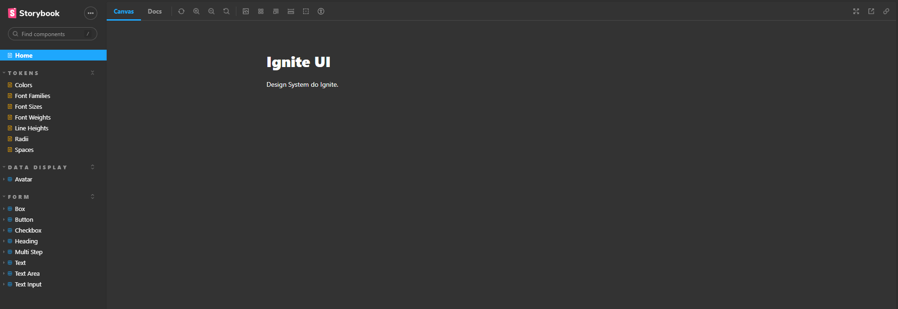

<p align="center">
  
</p>

<p align="center">
  <a href="#-technologies">Technologies</a>&nbsp;&nbsp;&nbsp;|&nbsp;&nbsp;&nbsp;
  <a href="#-project">Project</a>&nbsp;&nbsp;&nbsp;|&nbsp;&nbsp;&nbsp;
  <a href="#-screenshot">Screenshot</a>&nbsp;&nbsp;&nbsp;|&nbsp;&nbsp;&nbsp;
  <a href="#-how-to-run">How to run</a>&nbsp;&nbsp;&nbsp;|&nbsp;&nbsp;&nbsp;
  <a href="#-license">License</a>
</p>

<p align="center">
     
</p>

<br>

## 🧪 Technologies

This project was developed with the following technologies:

- [React](https://reactjs.org)
- [TypeScript](https://www.typescriptlang.org/)
- [Storybook](https://storybook.js.org/)
- [Turborepo](https://turborepo.org/)
- [Radix](https://www.radix-ui.com/)
- [Stitches](https://stitches.dev/)
- [TSUP](https://github.com/egoist/tsup)

## 🍺 Project

Ignite Design System is a Monorepo that provides components and tokens to build projects in the same style guide.

This project has CI/CD to publish the packages on the NPM and the storybook on the GitHub Pages.

The storybook with all the components and tokens can be found [here](https://thefalked.github.io/04-design-system/?path=/story/home--page).

The project uses:

✔ React

✔ TypeScript

✔ Storybook

✔ Turborepo

✔ Vite

✔ TSUP

✔ Radix

✔ Stitches

### Tokens

- [x] Colors
- [x] Fonts
- [x] Font Sizes
- [x] Font Weights
- [x] Line Heights
- [x] Radii
- [x] Space

### Components

- [x] Text
- [x] Heading
- [x] Box
- [x] Button
- [x] TextInput
- [x] TextArea
- [x] Checkbox
- [x] Avatar
- [x] MultiStep

## 🖼 Screenshot

<p align="center">
     
</p>

## 🚀 How to run

Clone the project and access its folder.

```bash
$ git clone https://github.com/thefalked/04-design-system.git
$ cd 04-design-system
```

To start it, follow the steps below:

```bash
# Install dependencies
$ npm run dev

# Start the project
$ npm run dev
```

## 📝 License

This project is under the MIT license. See the [LICENSE](LICENSE) file for more details.
